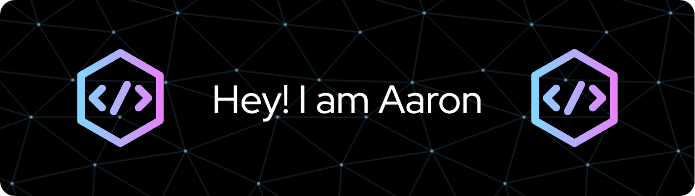

# 

  
  
  
  
  <a href="https://stackoverflow.com/users/2807652/aaron-becker">
    

---

**SKILLS**

&nbsp;&nbsp;
&nbsp;&nbsp;
&nbsp;&nbsp;
&nbsp;&nbsp;
&nbsp;&nbsp;

&nbsp;&nbsp;
&nbsp;&nbsp;
&nbsp;&nbsp;

&nbsp;&nbsp;
&nbsp;&nbsp;
&nbsp;&nbsp;
&nbsp;&nbsp;
&nbsp;&nbsp;

**CURRENTLY LEARNING**

&nbsp;&nbsp;
&nbsp;&nbsp;
&nbsp;&nbsp;